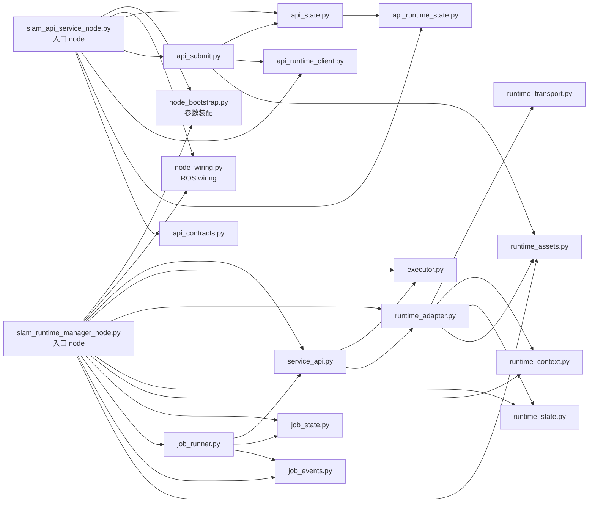
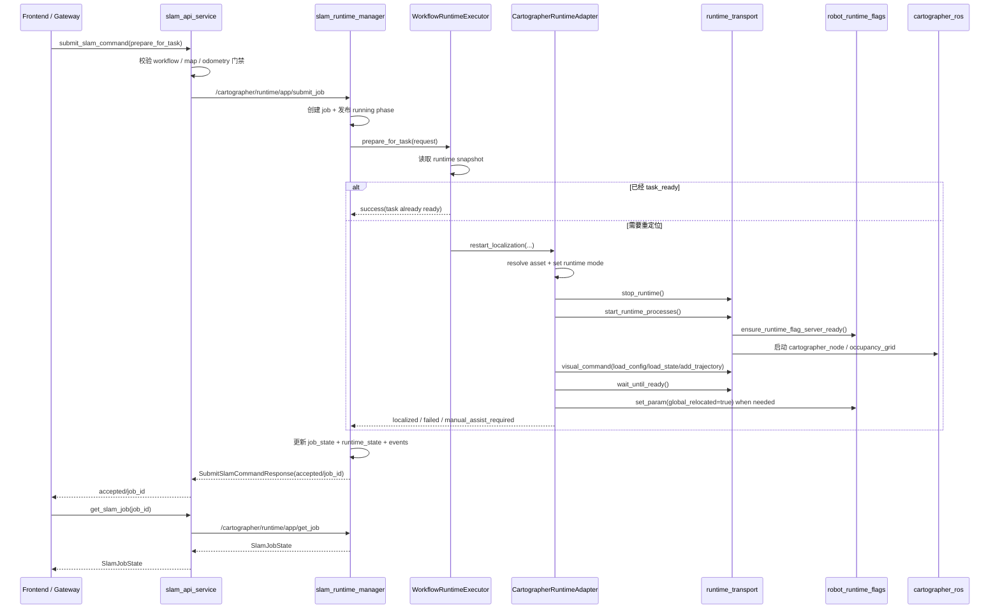
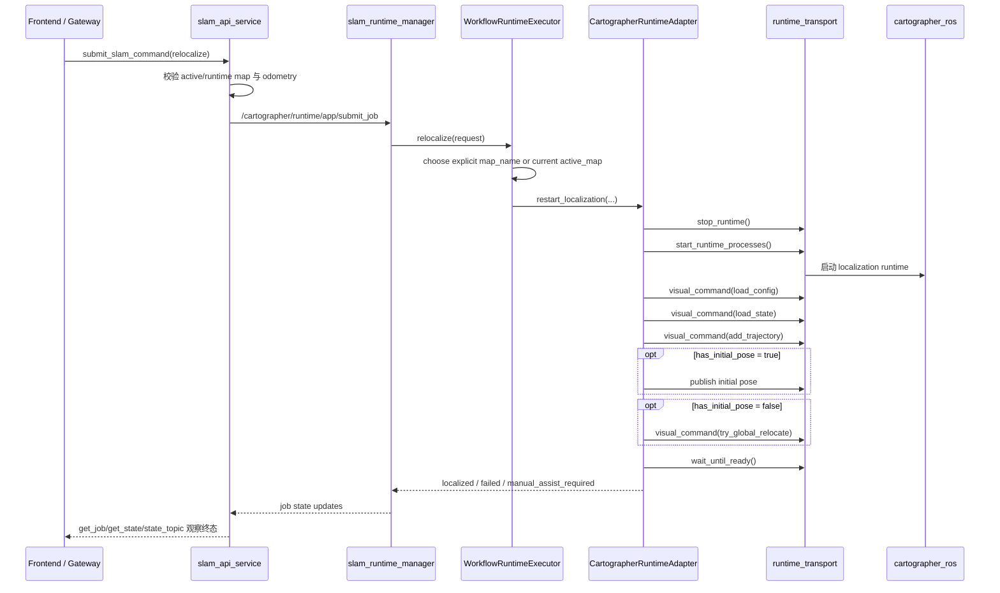
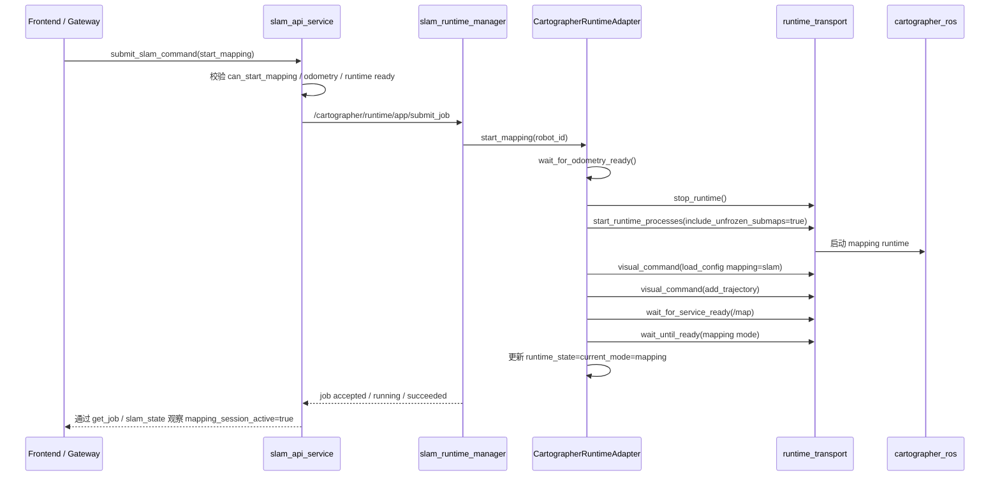
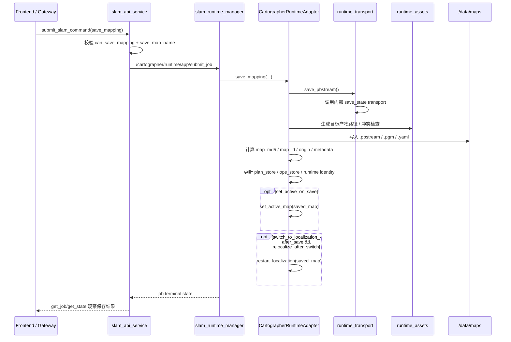
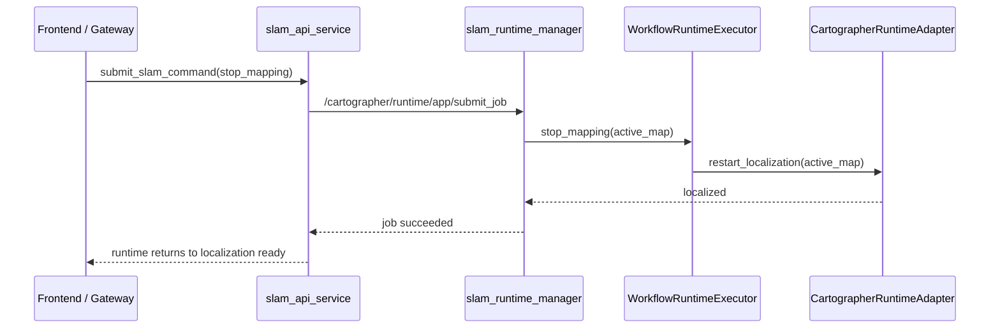

# SLAM Runtime 架构说明 v1

## 定位说明

这份文档是当前后端 `SLAM / runtime / readiness / task` 主链的总体架构说明。

它适合回答：

- 谁是对外 contract owner
- 谁是 runtime owner
- 哪些包属于正式主链
- 哪些历史原型能力已经退出主链

它不替代字段级 API contract，也不替代脚本启停说明。

如果你要看具体 service / topic 名称，继续看：

- [frontend_backend_interface_v1.md](/home/sunnybaer/Doraemon/docs/frontend_backend_interface_v1.md)

## 本轮内容校验依据

本轮已按当前运行主链代码与 launch 默认值核对这份架构说明，重点依据包括：

- [planner_server.launch](/home/sunnybaer/Doraemon/src/coverage_planner/launch/planner_server.launch)
- [task_system.launch](/home/sunnybaer/Doraemon/src/coverage_task_manager/launch/task_system.launch)
- [start_runtime.sh](/home/sunnybaer/Doraemon/scripts/start_runtime.sh)
- [slam_runtime_manager_node.py](/home/sunnybaer/Doraemon/src/coverage_planner/scripts/slam_runtime_manager_node.py)
- [slam_api_service_node.py](/home/sunnybaer/Doraemon/src/coverage_planner/scripts/slam_api_service_node.py)
- [localization_lifecycle_manager_node.py](/home/sunnybaer/Doraemon/src/coverage_planner/scripts/localization_lifecycle_manager_node.py)
- [task_manager.py](/home/sunnybaer/Doraemon/src/coverage_task_manager/src/coverage_task_manager/task_manager.py)

## 1. 文档目的

这份文档记录 **当前正式运行主链** 的 SLAM/runtime 架构，目标是让团队在后续做：

- 前后端联调
- 现场排障
- SLAM/定位能力继续重构
- 任务系统与 readiness 收口

时，能快速看清楚：

- 谁是对外 contract owner
- 谁是 runtime owner
- 谁负责 workflow 语义
- 谁只负责底层 transport / flag bus

本文档反映的是 **当前已经重构并 live 验证通过** 的正式结构，不再把历史原型链和过渡接口当成主链。

## 2. 当前 canonical 结论

当前商用清洁机器人后端中，SLAM/runtime 的 canonical 主链是：

1. 配置入口：
   - 部署覆盖：`/data/config/slam/cartographer`
   - 源码默认：`src/cleanrobot/config/slam/cartographer`
2. 低层 runtime flag 总线：`src/robot_runtime_flags`
3. 正式 runtime owner：`src/coverage_planner/scripts/slam_runtime_manager_node.py`
4. 正式对外 facade / contract owner：`src/coverage_planner/scripts/slam_api_service_node.py`
5. 定位生命周期入口：`src/coverage_planner/scripts/localization_lifecycle_manager_node.py`
6. 算法/runtime adapter：`src/cartographer_ros`
7. 任务系统接入层：`src/coverage_task_manager`

明确不是当前主链的：

- `slam_workflow_manager` 历史原型包（已从仓库主线移除）
- 根目录 `config/` 作为默认配置真源
- `param_space`
- `cartographer_ros` 历史 HTTP/WS 前端接口
- `cartographer_runtime_manager_node.py` / `static_map_manager_node.py` 这类历史 helper 已从正式 runtime 主线移除

## 3. 分层图

```mermaid
flowchart TD
    FE[Frontend / Site Gateway]
    API[slam_api_service_node.py\n正式对外 contract owner]
    LIFECYCLE[localization_lifecycle_manager_node.py\nrestart_localization facade]
    RUNTIME[slam_runtime_manager_node.py\nruntime owner / job owner]
    WF[coverage_planner/slam_workflow/*\n内部 workflow 分层]
    FLAGS[robot_runtime_flags\n/set_param /get_param /param_changes]
    CARTO[cartographer_ros\ncartographer_node + occupancy_grid]
    TASK[coverage_task_manager\n任务准备 / readiness / task start gate]
    CFG[cleanrobot/config/slam/cartographer\ncanonical config root]
    MAPS[/data/maps + map assets]

    FE --> API
    TASK --> API
    TASK --> LIFECYCLE
    API --> RUNTIME
    LIFECYCLE --> RUNTIME
    RUNTIME --> WF
    WF --> FLAGS
    WF --> CARTO
    CARTO --> MAPS
    RUNTIME --> MAPS
    CARTO --> CFG
```

## 4. 节点职责

### 4.1 `slam_api_service`

文件：

- `src/coverage_planner/scripts/slam_api_service_node.py`

职责：

- 对外暴露正式 SLAM contract
- 聚合 runtime state、job state、odometry state、task state
- 发布正式 topic
- 做 submit 前的 workflow/资产/门禁校验
- 作为前端与网关的唯一 SLAM facade
- 不再内置基于 shell 脚本的 cartographer script fallback；运行态启停统一由 runtime manager 与正式 runtime 入口负责

当前正式接口：

- `/clean_robot_server/app/get_slam_status`
- `/clean_robot_server/app/get_slam_job`
- `/clean_robot_server/app/submit_slam_command`
- `/clean_robot_server/slam_state`
- `/clean_robot_server/slam_job_state`

### 4.2 `slam_runtime_manager`

文件：

- `src/coverage_planner/scripts/slam_runtime_manager_node.py`

职责：

- 正式 runtime owner
- 正式 job owner
- 托管 runtime 级 submit/get/operate 服务
- 调用内部 workflow 层完成 Cartographer 编排

当前 node 已被收薄，主要只保留：

- runtime/job owner 身份
- 订阅 `/map`、`/tracked_pose`
- 发布 runtime job state
- 提供 runtime 级 service 入口

### 4.3 `localization_lifecycle_manager`

文件：

- `src/coverage_planner/scripts/localization_lifecycle_manager_node.py`

职责：

- 暴露 `/cartographer/runtime/app/restart_localization`
- 把“任务前重定位”封装成更稳定的生命周期入口
- 给 task manager/readiness 侧提供更简单的调用面

### 4.4 `coverage_task_manager`

职责：

- 任务 readiness owner
- 任务执行控制 owner
- 任务运行状态 owner
- 自动补能 / 自动恢复状态机 owner

当前正式接口：

- `/coverage_task_manager/app/get_system_readiness`
- `/coverage_task_manager/system_readiness`
- `/coverage_task_manager/app/exe_task_server`

当前明确边界：

- `/coverage_task_manager/app/exe_task_server` 由 `coverage_task_manager` 直接持有
- `/coverage_task_manager/cmd` 只保留给内部/调试命令
- 前端正式写入口不应再绕过 `/coverage_task_manager/app/exe_task_server`

任务侧自动补能 / 自动恢复当前收口语义：

- owner 仍是 `coverage_task_manager`
- 自动恢复主链收成：
  - `AUTO_SUPPLY / AUTO_CHARGING`
  - `AUTO_RELOCALIZING`
  - `AUTO_UNDOCKING`
  - `AUTO_RESUMING` 或 `AUTO_REDISPATCHING`
- `AUTO_RESUMING` 不能在“resume 已发出”时提前判完成，必须等 executor 真正回到 `CONNECT* / FOLLOW*`
- `WAIT_RELOCALIZE` 表示“暂停等待人工或上层恢复”，不是 terminal fault
- `/coverage_task_manager/event` 和 `task_state.last_event` 只适合作为最近动作 / 最近故障 / 自动恢复卡点的上下文，不应反向替代 `system_readiness`、`task_state` 或 `slam_state`

### 4.5 `robot_runtime_flags`

文件：

- `src/robot_runtime_flags/src/runtime_flag_server_node.cpp`

职责：

- 低层 runtime flag bus
- 提供：
  - `/set_param`
  - `/get_param`
  - `/param_changes`

定位：

- 只承载少量运行时 flag
- 不承载 workflow owner 语义
- 不承载前端业务接口
- 当前主要用于 `global_relocated` 这类流程标志

### 4.6 `cartographer_ros`

职责：

- 算法/runtime adapter
- 提供：
  - `cartographer_node`
  - `cartographer_occupancy_grid_node`

当前明确不承担：

- 前端正式 contract
- workflow owner
- 第二套 SLAM 业务 API

## 5. `coverage_planner/slam_workflow` 内部分层

当前已经落地的内部模块如下：

| 模块 | 职责 |
| --- | --- |
| `api.py` | 纯 workflow helper；动作常量、动作名、phase/state 映射、submit 校验与 workflow 投影。 |
| `executor.py` | workflow 动作语义；`prepare_for_task`、`switch_map_and_localize`、`relocalize`、`stop_mapping` 等上层抽象。 |
| `service_api.py` | runtime service 层分发；把 service handler 和 response 组装从 node 里抽离。 |
| `job_state.py` | job snapshot、内存状态、落库恢复、消息映射、active job 管理。 |
| `job_events.py` | `slam_job_started / slam_job_succeeded / slam_job_failed` 等事件发报。 |
| `runtime_assets.py` | 地图资产解析、目标产物路径和冲突检查。 |
| `runtime_context.py` | runtime snapshot、初始位姿发布、service 可用性、`/map` 与 `/tracked_pose` freshness 观测。 |
| `runtime_state.py` | runtime record 读写、ROS 参数同步、定位状态更新。 |
| `runtime_transport.py` | 底层 ROS/process transport；进程拉起、service 调用、runtime flag bus 就绪检查。 |
| `runtime_adapter.py` | ROS-heavy runtime 编排；`restart_localization`、`start_mapping`、`save_mapping` 等真正 orchestration。 |

这层内部模块的目标是：

- 让 `slam_runtime_manager_node.py` 成为薄入口
- 让 workflow 语义、资产逻辑、job 生命周期、runtime transport 分层清晰
- 避免再次长回“一个 2000+ 行脚本同时管所有事情”的状态

### 5.1 代码级模块图



## 6. 对外接口层 vs 内部 runtime 层

### 6.1 正式对外 contract

对前端、网关、任务接入方，当前 canonical SLAM contract 是：

- `/clean_robot_server/app/get_slam_status`
- `/clean_robot_server/app/get_slam_job`
- `/clean_robot_server/app/submit_slam_command`
- `/clean_robot_server/slam_state`
- `/clean_robot_server/slam_job_state`

正式接口文档见：

- `docs/frontend_backend_interface_v1.md`

### 6.2 内部 runtime 层

当前内部 runtime contract 是：

- `/cartographer/runtime/app/operate`
- `/cartographer/runtime/app/submit_job`
- `/cartographer/runtime/app/get_job`
- `/cartographer/runtime/job_state`
- `/cartographer/runtime/app/restart_localization`

这些接口是后端内部编排层用的，不是前端直接绑定的主入口。

### 6.3 底层算法/transport 层

底层适配与 process control 还会用到：

- `/visual_command`
- `/write_state`
- `/set_param`
- `/get_param`
- `/param_changes`

这些属于 runtime adapter 内部 transport 能力，不再作为产品 launch/config 的公开入口，也不应再扩散成前端业务接口。
其中 `save_state` trigger service 只作为内部 degraded fallback 保留；正式能力判断和产品公开面都以 app runtime submit/get 为准。

### 6.4 `task_ready` 与 `can_start_task` 的语义边界

当前主链里有两个容易混淆、但必须区分的信号：

- `SlamState.task_ready`
- `SystemReadiness.can_start_task`

建议按下面的语义理解和维护：

- `task_ready`
  - 由 `slam_api_service` 输出
  - 表示 **SLAM/runtime 侧已经具备任务前提**
  - 当前应同时满足：
    - `runtime_mode=localization`
    - `runtime_map_match=true`
    - `localization_state=localized`
    - `localization_valid=true`
    - `odometry_valid=true`
    - `task_running=false`
    - `manual_assist_required=false`
    - `busy=false`
- `can_start_task`
  - 由 `coverage_task_manager` 输出
  - 表示 **整机 readiness 允许真正启动任务**
  - 当前实现里，`coverage_task_manager` 会优先消费 fresh `/clean_robot_server/slam_state`
    - 若 `slam_state.task_ready=false`，则会把 `slam_state.blocking_reason / blocking_reasons[0]` 作为任务启动阻塞原因之一
    - 若 `slam_state` stale/missing，则退回本地 readiness 计算，不直接中断系统
    - 当 `slam_state` fresh 时，本地 `active_map / runtime_map / odometry / localization` 子检查更多作为诊断项和 fallback，不再独立重复决定 `can_start_task`
  - 除了 SLAM/odometry，还会再叠加：
    - mcore bridge
    - move_base_flex
    - battery / health
    - task manager / executor 空闲
    - 其他 readiness 检查

维护原则：

- `task_ready=true` 不能和明显的 `odometry invalid` 或 `task manager busy` 同时出现
- `can_start_task=true` 应建立在 `task_ready=true` 的基础上，而不是反过来替代它
- 前端在 SLAM 页面优先看 `task_ready`
- 前端在任务执行页面优先看 `can_start_task`

### 6.5 `odometry_valid` 的当前 canonical 语义

当前正式主链里，`odometry_valid` 已经按“通用底盘解耦”收成默认 `odom_stream` 模式：

- 默认不再把下面这些特定实现节点作为 `odometry_valid=true` 的前提：
  - `/wheel_speed_odom`
  - `/ekf_covariance_override`
  - `/wheel_speed_odom_ekf`
- 默认门槛改为：
  - `/odom` 新鲜
  - `frame_id` 合法
  - `child_frame_id` 合法

对外 contract 上，推荐优先读取这些通用字段：

- `validation_mode`
- `odom_stream_ready`
- `frame_id_valid`
- `child_frame_id_valid`
- `odom_valid`
- `odom_source`

换句话说：

- `odometry_valid` 现在表达的是“这条 odom 流可供 SLAM/readiness 门禁使用”
- 而不是“当前一定是 wheel_speed + imu + ekf 这条特定实现链在线”
- `odom_source` 现在是信息性摘要字段，允许是 `odom_stream` 或现场自定义实现名，但不应该再被上层写死成门禁判断

如果现场仍然想保留旧的严格链式门禁，可以把 `odometry_health_node.py` 切回：

- `validation_mode=strict_chain`

但当前 canonical 推荐是：

- `validation_mode=odom_stream`

## 7. 典型调用链

### 7.1 状态查询链

```text
Frontend / Gateway
  -> /clean_robot_server/app/get_slam_status
  -> slam_api_service
  -> 聚合 plan_store + ops_store + odometry_state + runtime job state + /map fresh + /tracked_pose fresh
  -> 返回 SlamState
```

### 7.2 `prepare_for_task` 时序



### 7.3 `relocalize` 时序



### 7.4 `start_mapping` 时序



### 7.5 `save_mapping` 时序



### 7.6 `stop_mapping` 时序



## 8. 配置与资产真源

### 8.1 配置真源

当前 `Cartographer` 配置已经收口成一套正式体系，只认两层 sanctioned config root：

1. 部署覆盖入口：`/data/config/slam/cartographer`
2. 源码默认真源：`src/cleanrobot/config/slam/cartographer`

运行时统一通过 `SLAM_CONFIG_ROOT` 传入配置目录，优先级规则是：

1. 如果 `/data/config/slam/cartographer` 存在且布局完整，优先使用它
2. 否则回退到 `src/cleanrobot/config/slam/cartographer`

源码默认真源下当前正式子目录包括：

- `slam/`
- `pure_location/`
- `pure_location_odom/`
- `relocalization/`
- `landmarks/`

默认参数和仓内基线配置统一从这里维护：

- `src/cleanrobot/config/slam/cartographer/slam/`
- `src/cleanrobot/config/slam/cartographer/pure_location_odom/`
- `src/cleanrobot/config/slam/cartographer/pure_location/`
- `src/cleanrobot/config/slam/cartographer/relocalization/`
- `src/cleanrobot/config/slam/cartographer/landmarks/`
- `src/cleanrobot/config/slam/cartographer/profiles.yaml`

主链配置读取当前已经统一到这些入口：

- `scripts/source_slam_runtime_env.sh`
- `src/coverage_planner/src/coverage_planner/slam_workflow/node_bootstrap.py`
- `src/coverage_planner/src/coverage_planner/slam_workflow/runtime_transport.py`

下面这些旧目录已经退出代码主链，不应再作为默认入口、运行时 fallback 或调参位置：

- 根目录 `config/`
- `src/cleanrobot/config/cartographer/`
- `src/slam_workflow_manager/runtime/config/`

维护时只保留两条规则：

1. 正式 `Cartographer` 参数改动，只改 `src/cleanrobot/config/slam/cartographer/`
2. 现场差异化覆盖，只放 `/data/config/slam/cartographer`

### 8.2 地图资产

主地图资产目录：

- `/data/maps`

外部地图导入目录：

- `/data/maps/imports`

运维说明：

- 正式地图资产目录：`/data/maps`
- 外部地图导入目录：`/data/maps/imports`

地图资产解析、导入、冲突检查等逻辑，当前由：

- `runtime_assets.py`

统一负责。

## 9. 已退场或不再 canonical 的东西

以下内容当前不应再被当成正式主链：

1. 已退场的 `slam_workflow_manager` 原型包
   - 设计可吸收
   - 但不是当前 runtime owner

2. `param_space`
   - 已退出正式主链
   - 当前已由 `robot_runtime_flags` 替代

3. 根目录 `config/`
   - 已退出代码主链并删除

4. `cartographer_ros` 历史 HTTP/WS 前端接口
   - 已退出正式产品接口链

5. 第二套独立 `/slam_workflow/*` 作为前端正式接口
   - 当前不采用双 canonical contract

6. `cleanrobot/cartographer_supervisor`
   - 已退出正式 bringup 主链
   - 不再属于正式安装交付入口
   - `cartographer_localization.launch` / `cartographer_mapping.launch` 只保留为源码工作区里的手工 legacy 调试入口

## 10. 运行与运维边界

正式运行脚本见：

- `scripts/start_runtime.sh`
- `scripts/stop_runtime.sh`
- `scripts/stop_all_backend.sh`
- `scripts/start_frontend_backend.sh`

`param_space` 已经完成正式退场，运行脚本与 runtime transport 现在只认 `robot_runtime_flags`。

### 10.1 正式脚本入口

当前只保留 4 个正式脚本入口：

- `scripts/start_frontend_backend.sh`
  - 只启动前端联调所需后端
  - 适合前后端联调、页面联调、站点编辑器/SLAM 工作台联调
- `scripts/start_runtime.sh`
  - 官方整机运行态启动入口
  - 会先确保 frontend service 会话存在，再启动 runtime 会话
- `scripts/stop_runtime.sh`
  - 只停运行态，保留前端/rosbridge/SLAM API/地图资产服务
- `scripts/stop_all_backend.sh`
  - 停止 Doraemon 后端整套会话
  - 在 Doraemon tmux 会话都不存在时可顺带停止 `roscore`

`start_runtime.sh` 当前默认还会顺手做：

- ROS contract 校验
- 重定位到当前 active map
- readiness 等待
- backend runtime smoke（默认只读）
- 可选 production acceptance gate（显式开启时）

当前常用方式：

前后端联调：

```bash
scripts/start_frontend_backend.sh
```

整机运行：

```bash
scripts/start_runtime.sh
```

启动后顺手做最小 workflow 验证：

```bash
BACKEND_RUNTIME_SMOKE_ACTIONS=prepare_for_task scripts/start_runtime.sh
```

启动收口后直接挂 production gate：

```bash
RUN_BACKEND_PRODUCTION_ACCEPTANCE=1 \
BACKEND_PRODUCTION_ACCEPTANCE_PROFILE=activate_revision_prepare_for_task_gate \
BACKEND_PRODUCTION_ACCEPTANCE_EXTRA_ARGS='--map-revision-id rev_demo_01' \
scripts/start_runtime.sh
```

停运行态但保留联调服务：

```bash
scripts/stop_runtime.sh
```

全停：

```bash
scripts/stop_all_backend.sh
```

### 10.2 维护说明

后续继续维护这条主链时，建议严格遵守下面几条：

- 不要再把 workflow 逻辑写回入口 node
  - `slam_api_service_node.py`
  - `slam_runtime_manager_node.py`
  - 这两个文件现在应该只做依赖拼装
- 新的 workflow 语义先落内部模块，再暴露到 contract
  - 先改 `coverage_planner/slam_workflow/*`
  - 再改 `cleanrobot_app_msgs`
  - 最后改前端文档
- 低层 transport 与高层 workflow 不能重新混在一起
  - 进程/ROS service/topic 调用进 `runtime_transport.py`
  - workflow 编排进 `runtime_adapter.py` / `executor.py`
- `robot_runtime_flags` 只做低层 flag bus
  - 不要往里放业务 workflow 语义
- `task_ready` 与 `can_start_task` 要一起看
  - 改动其中一边时，要补另一边的联动测试
- 忽略 `station_status` 时要明确写在现场边界里
  - 不要让它反向污染 SLAM/runtime 结构判断

### 10.3 推荐回归检查

每次改 SLAM/runtime 主链，至少跑这些：

1. Python 语法检查
2. `coverage_planner` 相关单测
3. `catkin build coverage_planner --no-status`
4. `stop_all_backend.sh -> start_runtime.sh`
5. live smoke
   - `get_slam_status`
   - `get_system_readiness`
   - `prepare_for_task -> get_slam_job`

## 11. 当前运行态最小检查项

### 11.1 节点

建议确认这些节点在线：

- `/slam_api_service`
- `/slam_runtime_manager`
- `/localization_lifecycle_manager`
- `/runtime_flag_server`
- `/cartographer_node`
- `/cartographer_occupancy_grid_node`

### 11.2 服务类型

建议确认：

- `/set_param -> robot_runtime_flags_msgs/SetParam`
- `/get_param -> robot_runtime_flags_msgs/GetParam`
- `/coverage_task_manager/app/exe_task_server -> cleanrobot_app_msgs/ExeTask`
- `/clean_robot_server/app/get_slam_status -> cleanrobot_app_msgs/GetSlamStatus`
- `/clean_robot_server/app/submit_slam_command -> cleanrobot_app_msgs/SubmitSlamCommand`

### 11.3 readiness

建议确认：

- `overall_ready=true`
- `can_start_task=true`
- `localization_state=localized`
- `runtime_map_name == active_map_name`

## 12. 当前已知残余

当前与本架构无关、但现场可能仍出现的告警：

- `station_status stale or missing`

这属于 readiness 现场状态问题，不影响当前 SLAM/runtime 架构的 owner 与分层判断。

## 13. 一句话总结

当前 Doraemon 工程中的 SLAM/runtime 已经收成了这样的正式结构：

- `slam_api_service` 负责对外
- `slam_runtime_manager` 负责 runtime 和 job owner
- `coverage_planner/slam_workflow` 负责内部 workflow 分层
- `robot_runtime_flags` 负责低层 flag bus
- `cartographer_ros` 只负责算法/runtime adapter

这就是当前应继续演进和维护的商用主链。
